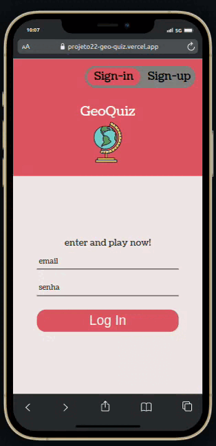
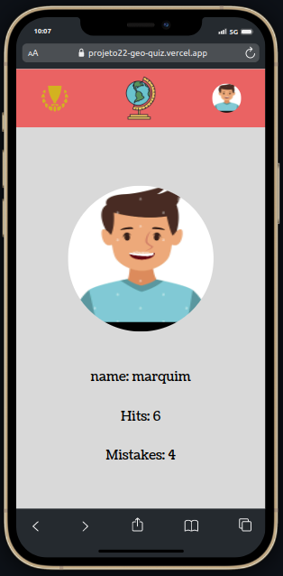
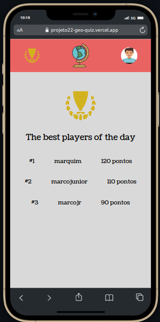
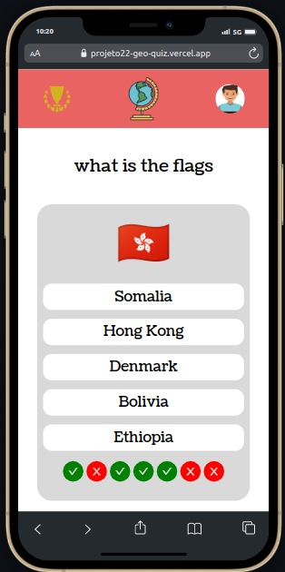
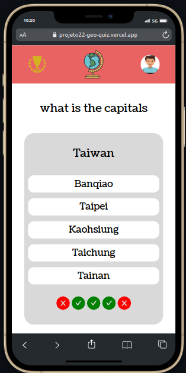

# GeoQuiz
Aos 5 anos de idade Magnus Carlsen memorizou a superfície, população e as capitais de todos os países, anos mais tarde esse jovem viria a se tornar para muitos o maior jogador de xadrez de todos os tempos

<p align="center">
   
</p>


- Vivemos na era da comunicação, e é cada vez mais nos exigido se manter atualizado não só sobre nossa cidade mas sobre os mais diversos países do globo o tempo todo, (pois como diria o ditado "Sem geografia, você não está em lugar nenhum")
- *Ok, Ok, Entendi, mas como faço para compreender todas as informações se não mando bem em geografia?*
- Não tema! para isso surgiu o GeoQuiz, um site onde você pode testar e praticar seus conhecimentos sobre o tema, será que você consegue chegar ao top #1 do nosso placar diário?

- [veja meu deploy na Vercel aqui](https://projeto22-geo-quiz.vercel.app/)
- [veja meu repositório back end dessa aplicação aqui](https://github.com/marcojr73/projeto22-geoQuiz-API)

***

## Demonstração

<p align="center">
   
   
   
   
   
   
</p>

## Como usar

Instale meu projeto e suas dependências

```bash
  git clone git@github.com:marcojr73/projeto22-geoQuiz.git
```

```bash
  npm install
  
  npm run start
```

***

##	 Tecnologias e Conceitos

- React
- Context API
- LocalStorage
- Toasts (react-toastify) 
- styled-Componentes
- Sendgrid

***
    
